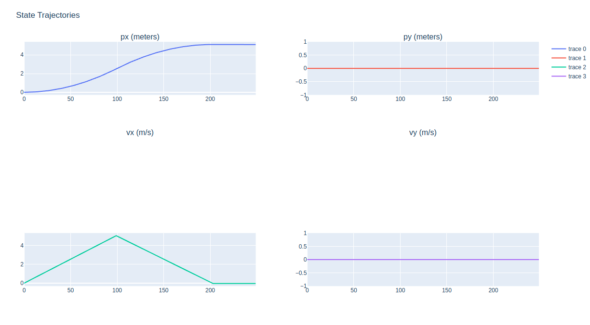
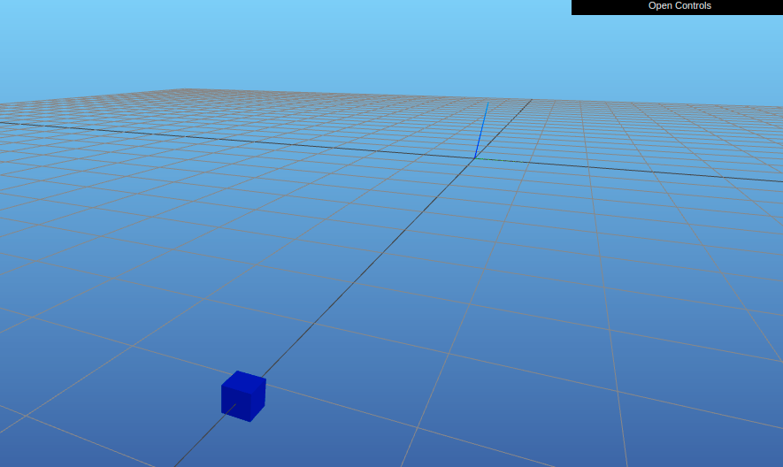

# dynamics_sim
Basic dynamics simulation and control playground

# Installation
Clone this repo

```
git clone git@github.com:nlitz88/dynamics_sim.git && \
cd dynamics_sim
```

(Optional) Create a virtual environment (have to install )

```
python -m venv venv
```

Install Python dependencies

```
pip install -r requirements.txt
```

# Usage
Run the simulation with
```
python simulate.py
```

This will launch one page with interactive
[Plotly](https://github.com/plotly/plotly.py) graphs and another with a
[Meshcat](https://github.com/meshcat-dev/meshcat) 3D visualization in your
browser.


